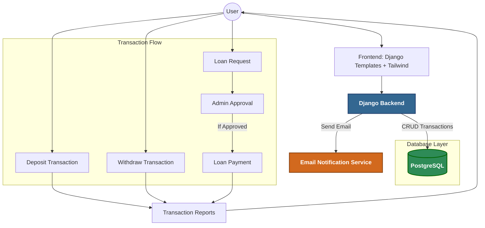

# AH's Finance

## Overview:

**AH's Finance** is a lightweight finance and transaction management system built with **Django** and **PostgreSQL**.  
It allows users to manage deposits, withdrawals, loan requests, loan approvals/payments, and generate transaction reports with date-range filtering.  
The system also includes **email notifications** and an **admin loan approval flow** for better transaction control.

---

## Features:

- **User Authentication & Account Management**  
  - User registration, login, profile updates  
- **Transaction Management**  
  - Deposit and Withdraw operations  
  - Loan Requests (pending approval by admin)  
  - Loan Payments after approval  
- **Reports & Analytics**  
  - Transaction reports with date-range filtering  
- **Email Notifications**  
  - Triggered on key transactions (deposit, withdraw, loan actions)  
- **Admin Loan Approval Workflow**  
  - Superusers (admins) can approve/reject loan requests  

---

## System Design:



## Technical Specifications:

* **Backend Framework**: Django
* **Frontend**: Django Templates, Tailwind CSS
* **Database**: PostgreSQL
* **Email Service**: SMTP

## Getting Started:

### Prerequisites

* Python 3.x
* Django 5.x
* PostgreSQL 14+
* pip / pipenv / virtualenv

### Build and Run

1. Clone repo:
   ```bash
   git clone https://github.com/alaminatcs/ah-finance.git
   cd ah-finance
   ```
2. Create venv:
   ```bash
   # venv for ubuntu
   python3 -m venv ubenv
   source ubenv/bin/activate

   # Or windows
   python -m venv wienv
   wienv\Scripts\activate
   ```
3. Install Dependencies:
   ```bash
   pip install -r requirements.txt
   ```
4. Database Settings:
   ```psql
   CREATE USER your_db_user WITH PASSWORD 'your_password';
   CREATE DATABASE your_db_name OWNER your_db_user;
   ```
5. Create .env:
   ```
   # For Database
   SECRET_KEY=your_secret_key
   DB_NAME=your_db_name
   DB_USER=your_db_user
   DB_PASSWORD=your_db_password
   DB_HOST=your_db_host
   DB_PORT=5432
    
   # For Email
   EMAIL_HOST_USER=your_host_email
   EMAIL_HOST_PASSWORD=your_email_host_password
   ```
6. Run migrations:
   ```bash
   python manage.py migrate
   ```
7. Create a superuser:
   ```bash
   python manage.py createsuperuser
   ```
8. Run on local browser:
   ```bash
   python manage.py runserver
   ```


## Future Enhancements:

- [ ] REST API with Django REST Framework
- [ ] Dockerize the project
- [ ] Add unit & integration tests
- [ ] Role-based access (Admin, User, Cashier)
- [ ] Add CI/CD (GitHub Actions)

## Contributions:

 - Feel free to submit a Pull Request.

## Screenshots:

